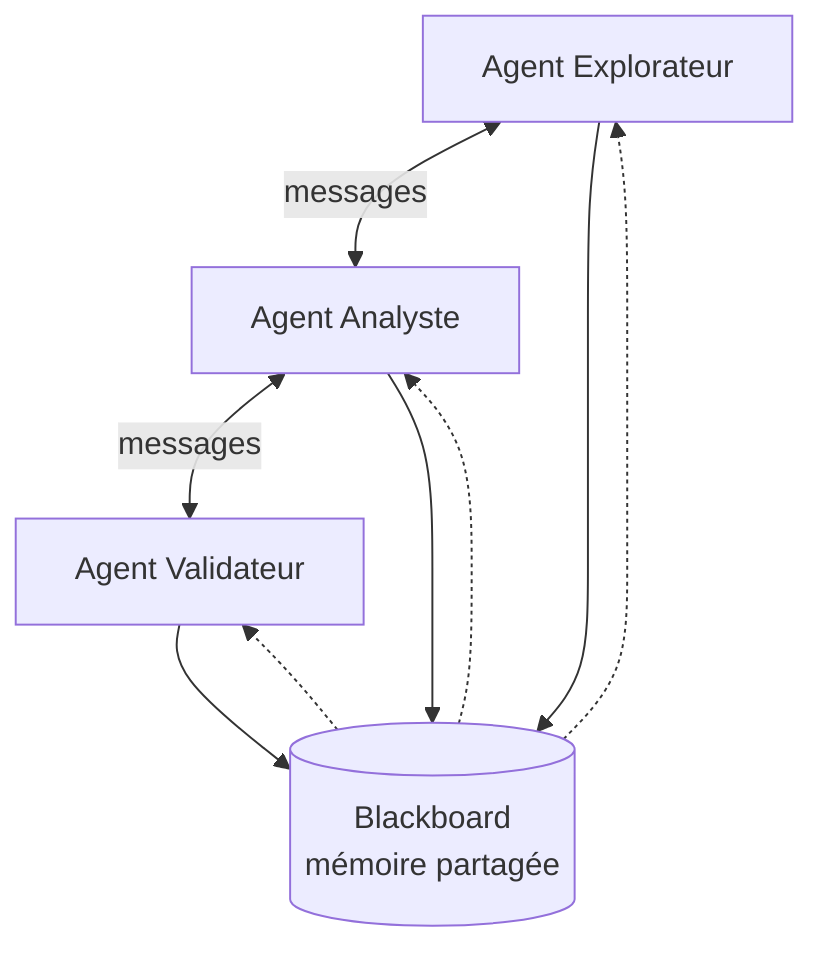

## Au-delà du single-agent

Le pattern "un LLM qui fait tout" atteint vite ses limites. Un agent unique qui doit à la fois chercher de l'information, raisonner, valider ses résultats et produire une sortie finit par être un monolithe ingérable.

Les **Systèmes Multi-Agents (MAS)** proposent une alternative : décomposer le problème en agents spécialisés qui collaborent.

## Principes fondamentaux

Un système multi-agents repose sur trois piliers :

### Autonomie

Chaque agent a un périmètre de responsabilité défini et prend ses propres décisions dans ce périmètre. Il n'y a pas de chef d'orchestre omniscient.

### Communication

Les agents échangent des messages structurés. Le protocole de communication définit ce qui peut être dit (ontologie partagée) et comment (format des messages, tours de parole).

### Émergence

Le comportement global du système émerge des interactions locales entre agents. C'est ce qui rend les MAS à la fois puissants et difficiles à débugger.

## Architecture type

Voici un pattern qui a fait ses preuves dans mes projets :

- **L'Explorateur** interroge les sources de données et propose des hypothèses
- **L'Analyste** évalue les hypothèses en les confrontant aux connaissances du domaine
- **Le Validateur** vérifie la cohérence logique et les contraintes
- Le **Blackboard** est l'espace de travail commun où les résultats intermédiaires sont déposés

## MAS + LLM : la combinaison actuelle

L'arrivée des LLM a revitalisé le domaine des MAS. Chaque agent peut maintenant être alimenté par un LLM avec un prompt spécialisé, combinant la flexibilité du langage naturel avec la rigueur architecturale des systèmes multi-agents.

Quelques frameworks qui implémentent cette approche :

| Framework | Approche | Commentaire |
|---|---|---|
| **CrewAI** | Agents avec rôles prédéfinis | Simple, bon pour démarrer |
| **AutoGen** | Conversations multi-agents | Flexible, orienté recherche |
| **LangGraph** | Graphe d'états | Contrôle fin, production-ready |

## Les pièges classiques

### Le bavardage

Des agents qui s'envoient des messages en boucle sans converger vers une solution. Il faut toujours définir des **conditions d'arrêt** explicites et un nombre maximum d'itérations.

### La sur-spécialisation

Créer 15 agents ultra-spécialisés pour un problème qui en nécessite 3. Commencez simple, ajoutez des agents uniquement quand un agent existant a trop de responsabilités.

### L'opacité

Un MAS peut être aussi opaque qu'un réseau de neurones si on ne trace pas les échanges. Loggez systématiquement les messages inter-agents et les décisions prises.

## Mon approche

Dans mes travaux en oncologie, j'utilise des MAS non pas avec des LLM, mais avec des agents à base de règles couplés à des réseaux de neurones sur graphes. Chaque agent a une sémantique formelle définie par une ontologie.

C'est moins "magique" que les approches full-LLM, mais c'est **explicable**, **reproductible** et **validable** — trois propriétés non négociables en recherche médicale.

---

*Pour une revue complète des approches agentiques en modélisation biologique, voir mon article dans [Artificial Intelligence in Medicine](/research/aim-2024-agent-based-biological-modeling-oncology/).*
