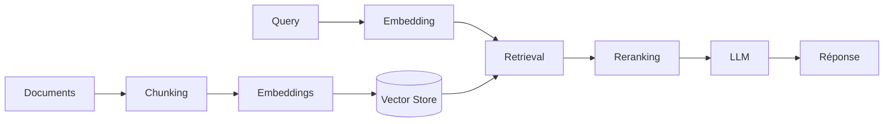

## Le problème

La plupart des tutoriels RAG s'arrêtent au prototype. Appeler une API d'embedding, stocker des vecteurs dans ChromaDB et interroger un LLM, ça tient en 50 lignes de Python. Mais entre ce prototype et un système fiable en production, il y a un gouffre.

Lors de mon passage chez OPSOMA, j'ai conçu un pipeline RAG complet pour automatiser la recherche dans une base documentaire technique de plusieurs milliers de documents. Voici ce que j'en retiens.

## Architecture retenue

### Chunking : le maillon critique

Le découpage des documents est le facteur qui influence le plus la qualité des résultats. Après plusieurs itérations :

- **Taille de chunk** : 512 tokens avec un overlap de 64 s'est avéré être le meilleur compromis
- **Découpage sémantique** : on ne coupe pas au milieu d'un paragraphe. Un splitter basé sur la structure du document (titres, sections) surpasse systématiquement un découpage naïf par nombre de tokens
- **Métadonnées** : chaque chunk embarque le titre du document source, la section parente et la date. Ces métadonnées sont essentielles pour le filtrage en amont du retrieval

### Reranking : le gain silencieux

Le retrieval par similarité cosinus retourne souvent des résultats "proches mais hors sujet". L'ajout d'un **cross-encoder** en phase de reranking a amélioré la précision de nos réponses de manière significative, pour un coût de latence acceptable (~100ms sur les 10 premiers résultats).

## Les pièges rencontrés

### 1. La dérive des embeddings

Les modèles d'embedding évoluent. Une mise à jour du modèle invalide l'intégralité de votre vector store. Il faut :
- Versionner le modèle d'embedding utilisé
- Prévoir un pipeline de ré-indexation complet
- Ne jamais mélanger des vecteurs issus de modèles différents

### 2. L'évaluation

Comment mesurer la qualité d'un système RAG ? Nous avons mis en place :
- Un **jeu de test** de 200 questions/réponses validées par des experts métier
- Des métriques de **retrieval** (recall@k, MRR) séparées des métriques de **génération** (fidélité, pertinence)
- Un pipeline d'évaluation automatisé exécuté à chaque modification

### 3. Le coût

En production, chaque requête implique : un appel d'embedding, une recherche vectorielle, un reranking, et un appel LLM. Le coût unitaire est faible, mais à 10 000 requêtes/jour, l'addition monte vite. Le caching des embeddings de requêtes fréquentes a réduit notre facture de 35%.

## Ce que je ferais différemment

- **Commencer par l'évaluation**, pas par l'architecture. Définir les métriques de succès avant d'écrire la première ligne de code
- **Investir dans le chunking** dès le début. C'est le levier qui a le meilleur ratio effort/impact
- **Prévoir le multimodal** dans l'architecture initiale. Nos documents contenaient des schémas techniques qu'on a dû ignorer dans la V1

## Stack technique

| Composant | Choix |
|---|---|
| **Embeddings** | `text-embedding-3-large` (OpenAI) |
| **Vector Store** | Qdrant (auto-hébergé) |
| **Reranker** | `cross-encoder/ms-marco-MiniLM-L-6-v2` |
| **Orchestration** | LangChain (avec réserves) |
| **Évaluation** | RAGAS + jeu de test custom |

---

*Cet article est le premier d'une série sur l'industrialisation de systèmes IA. Le prochain portera sur les systèmes de décision hybrides combinant moteurs de règles et LLM.*
