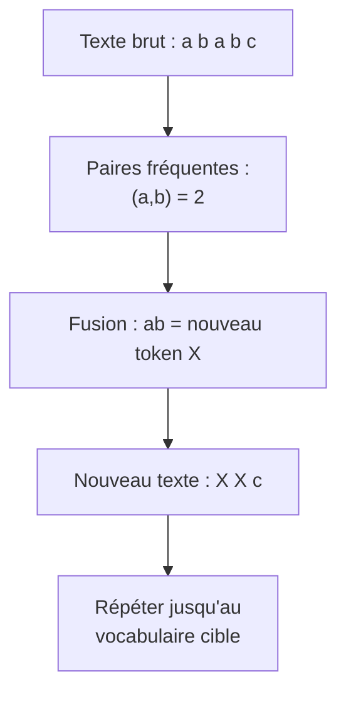
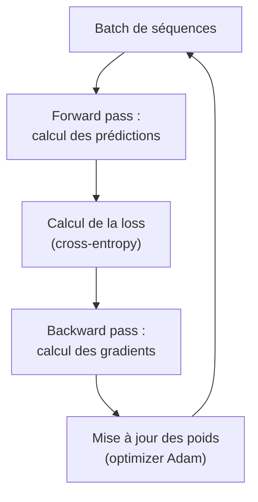
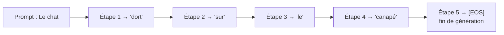
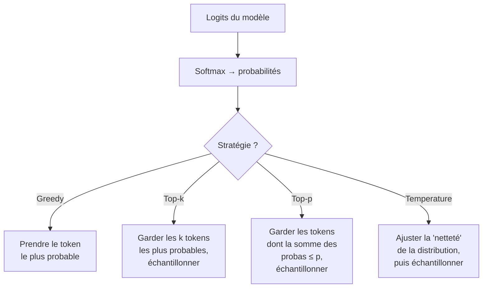
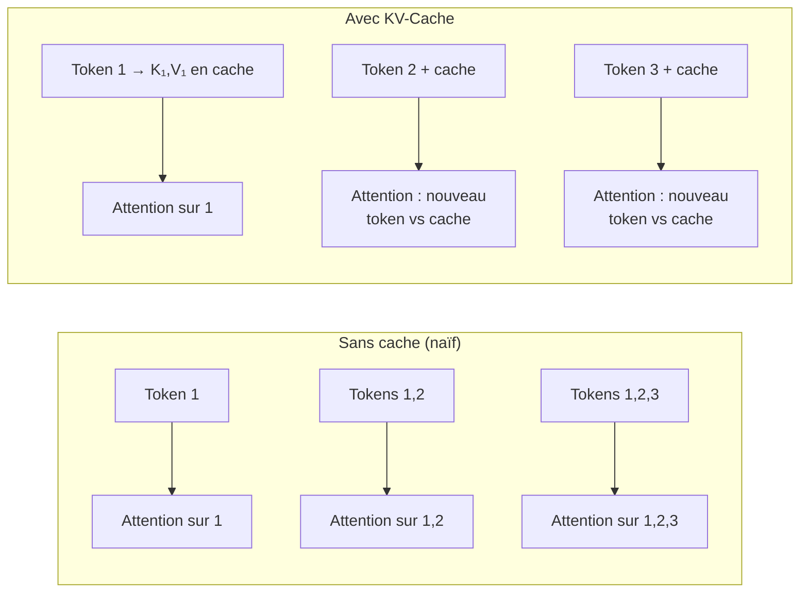
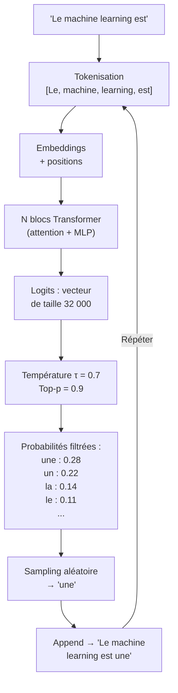
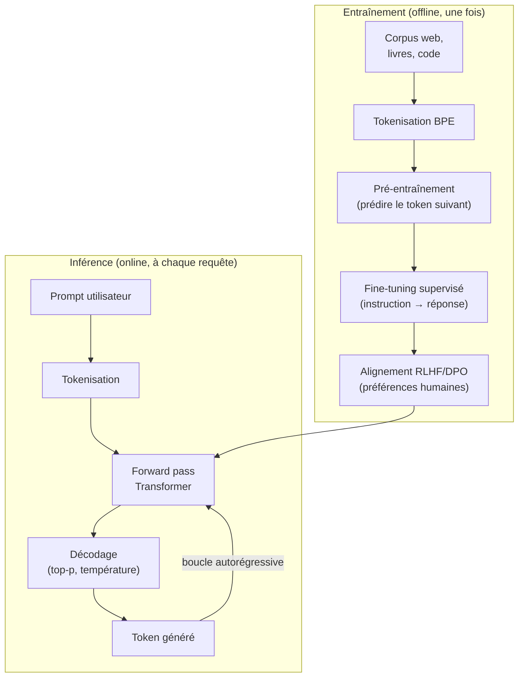

**"Comment fonctionne un modèle génératif ?"**.
*Spoiler : Ce n'est pas magique !* Les modèles génératifs sont des bijoux statistiques qui ont appris à partir d'une quantité astronomique de contenu, à prédire le texte que tu attends.
Dans cet article, nous allons voir comment cela fonctionne.

---

## Vue d'ensemble

Au coeur des systèmes comme ChatGPT (OpenAI), Claude (Anthropic) ou encore Gemini (Google), il y a un modèle d'intelligence artificielle nommé **LLM**.
Un **LLM** (**L**arge **L**anguage **M**odel) est un modèle statistique qui a appris à faire une chose : **prédire le mot suivant**.

Si l'on analyse le langage humain, on peut s'apercevoir qu'il suit des structures récurrentes, des motifs statistiques ultra-complexes mais que les algorithmes sont tout à fait en mesure de déceler.

> **Par exemple :** Si je commence une phrase par "Le chat dort sur le", instinctivement vous vient à l'esprit un ensemble de mots comme "capané", "lit" ou encore "radiateur".
Il est peu probable que vous ayez directement pensé à "radis" ou à "astronaute".

À l'aide de statistique, il semble possible de prédire le mot suivant le plus probable.
L'objectif d'un LLM est de maîtriser ces probabilités à une échelle bien plus grande afin de devenir une sorte de simulateur du langage ultra-crédible.

Pour apprendre à parler, la machine a besoin d'exemples. En mettant de côté les débats éthiques et légaux, les chercheurs se sont alors tournés vers la plus grande bibliothèque jamais créée : Internet.
Sur internet, on trouve de tout :
- des articles de blog aux publications scientifiques
- des commentaires sous les vidéos aux des conversations privées
- de la documentation technique aux lignes de codes
- de la littérature classique aux articles de presse
- etc

Cette diversité de contenu permet au modèle d'apprendre non seulement la grammaire, mais aussi le ton, le contexte, les nuance du langage...
Mais pour en arriver là, il faut d'abord mettre en place un algorithme capable d'ingérer toute cette complexité et de la stocker dans un format utilisable : le modèle.

Le cycle de vie des projets reposant sur des LLM se divise en deux phases :

1. **Phase 1 : Entraînement**. Pour qu'un modèle génératif soit capable de générer, il faut d'abord le créer et cette création, se fait lors de la phase d'entrainement.
2. **Phase 2 : Génération**. Une fois créé le modèle a enregistré toute les subtilités statistiques des textes qu'il a utilisé pour son entrainement, il est maintenant prêt à prédire le mot suivant.

Entrons un peu plus dans le détail.

## Partie 1 — L'entraînement

L'entrainement d'un LLM est une prouesse technique et mathématique. C'est là que l'on transforme des péta-octets de texte brut, en un modèle de quelques giga-octets, capable de "prédire" du texte.

### 1.1 Les données : le carburant du modèle

Tout commence par un **corpus** colossal.
Contrairement à d'autres système d'apprentissage (comme le classement d'images par exemple), ces données sont non labellisées.
C'est à dire qu'il n'est pas nécessaire de dire au modèle "ceci est un poème" ou "ceci est du code" ; on lui donne tout en vrac.
Dans ce cas de figure, on s'appuie sur une méthode **auto-supervisée**.
Le modèle apprend seul en se masquant des mots et en essayant de les deviner. Il est son propre professeur.

> Note : C'est notamment cette phase qui explique pourquoi les géants comme Google, Meta ou Microsoft dominent : ils possèdent l'infrastructure pour stocker et traiter ces volumes de données que peu d'acteurs peuvent manipuler.

### 1.2 La tokenisation

Un ordinateur ne comprend pas les mots. En fait, il ne comprend même pas les lettres. Pour lui, tout n'est que des suites de 0 et de 1.
Afin de l'aider à comprendre l'organisation de notre vocabulaire, nous allons découper le texte en unités appelées **tokens**.

Un token n'est pas forcément un mot entier.
L'algorithme BPE (Byte Pair Encoding), par exemple, découpe les mots fréquents en un seul bloc, mais fragmente les mots rares ou complexes.
Cela permet au modèle de comprendre la racine des mots (ex: "aimer", "aimable", "aimant" partagent le même début de token) et de ne jamais être bloqué par un mot inconnu.

> *Exemple : "Les transformers sont puissants"*
→ ["Les", " transform", "ers", " sont", " puiss", "ants"]

L'algorithme **BPE** construit ensuite un dictionnaire de ~32 000 à ~100 000 tokens en fusionnant itérativement les paires de caractères les plus fréquentes.



### 1.3 L'objectif d'entraînement : prédire le mot suivant

Le cœur du réacteur est une règle statistique simple : **étant donné une séquence, quel est le prochain morceau de texte le plus probable ?**

Mathématiquement, pour une séquence de tokens `$(x_1, x_2, \dots, x_{t-1})$`, le modèle cherche à prédire la distribution de probabilité du token suivant $x_t$ :

Pour chaque prédiction, le modèle compare sa réponse à la réalité de sont corpus original.
Il calcul alors une "Loss" (Perte), via la fonction de cross-entropy (entropie croisée).
Cette méthode permet de mesure un écart entre la prédiction et la réalité.
Plus le modèle est "surpris" par le vrai mot, plus la perte est élevée

A l'aide d'un algorithme de **descente de gradient** (souvent l'optimiseur *Adam*),
le système ajuste légèrement ses milliards de paramètres internes (les poids du réseau) afin de minimiser cette perte.
Ainsi, la prochaine fois qu'il aura à sélectionner un mot pour cette suite de token, il se rapprochera un peu plus de la réalité.



### 1.4 L'architecture Transformer

Le Transformer est le moteur de tous les LLM modernes (GPT, Claude, LLaMA, Mistral...).
Son innovation provient de son mécanisme clé : l'**attention**

L'attention permet au modèle de ne pas lire de gauche à droite comme un humain, mais de regarder tous les mots d'une phrase simultanément pour comprendre les liens logiques.

> Par exemple : dans la phrase "L'animal n'a pas traversé la rue car il était trop fatigué", l'attention permet au modèle de comprendre que "il" se rapporte à "l'animal".

### 1.5 Quelques chiffres

Récemment, une entreprise m'a demandé : "Mais vous, vous avez déjà créé votre propre modèle de LLM ?"
Alors, la réponse rapide est **non**. Pourquoi ?
Pour entrainer un modèle comme GPT-4 (OpenAI) ou encore LLAMA-3 (Meta), il a fallut stocker, traiter, comprendre près de **15'000 milliards (15'000'000'000'000) de tokens**.
Cela représente plusieurs millions de livres, soit **plusieurs péta-octets de données**.
Il a ensuite fallut faire passer ces tokens dans des réseaux de neurones, tournant sur une architecture matérielle complexe,
qui utilise **plusieurs milliers de GPU de type H100** (30 000€ l'unité),
le tout pendant des mois.

Le coût estimé, entre l'architecture matériel et la facture d'électricité ? Environ **100 millions de dollars**.

Alors évidemment, vous pouvez diminuer tout cela, faire fonctionner un simple algorithme d'apprentissage, sur votre ordinateur, pendant quelques jours en vous basant uniquement sur des textes dont vous avez les droits.
Mais le résultat sera plus que limité.

### 1.6 Exemple pratique en Python

Voici un micro-exemple d'entraînement d'un modèle de langage minimaliste avec **PyTorch** pour illustrer le principe.
On entraîne un tout petit Transformer sur quelques phrases :

```python
import torch
import torch.nn as nn
from torch.nn import TransformerDecoderLayer

# --- 1. CONFIGURATION DES HYPERPARAMÈTRES ---
vocab_size = 128        # Taille du vocabulaire (ASCII simplifié)
d_model = 64            # Dimension de l'espace vectoriel (embeddings)
nhead = 4               # Nombre de mécanismes d'attention travaillant en parallèle
num_layers = 2          # Nombre de blocs Transformer empilés
seq_len = 16            # Longueur maximale de la mémoire (fenêtre de contexte)

# --- 2. PRÉPARATION DES DONNÉES ---
# Texte d'exemple pour l'apprentissage
texte = "le chat dort sur le canape. le chien joue dans le jardin."
# Conversion du texte en nombres (chaque caractère devient son code ASCII)
data = torch.tensor([ord(c) for c in texte], dtype=torch.long)

# --- 3. ARCHITECTURE DU MINI-LLM ---
class MiniLLM(nn.Module):
    def __init__(self):
        super().__init__()
        # Couche d'embedding : transforme un index (0-127) en vecteur dense (64)
        self.embed = nn.Embedding(vocab_size, d_model)
        # Embedding de position : donne au modèle la notion d'ordre des mots
        self.pos_enc = nn.Embedding(seq_len, d_model)
        # Empilement de couches Transformer (le "cerveau" du modèle)
        self.layers = nn.ModuleList([
            TransformerDecoderLayer(d_model, nhead, dim_feedforward=128, batch_first=True)
            for _ in range(num_layers)
        ])
        # Couche de sortie : projette les vecteurs vers les probabilités du vocabulaire
        self.head = nn.Linear(d_model, vocab_size)

    def forward(self, x):
        # Création des indices de position (0, 1, 2...)
        positions = torch.arange(x.size(1), device=x.device)
        # Fusion de l'identité du mot et de sa position
        h = self.embed(x) + self.pos_enc(positions)

        # Masque causal : crucial pour empêcher le modèle de "voir" le futur
        # pendant l'entraînement (on cache les mots à droite)
        mask = torch.triu(torch.ones(x.size(1), x.size(1), device=x.device), diagonal=1).bool()

        # Passage à travers les couches de calcul
        for layer in self.layers:
            h = layer(h, h, tgt_mask=mask, memory_mask=mask)

        return self.head(h)

# Initialisation du modèle, de l'optimiseur et de la fonction de perte
model = MiniLLM()
optimizer = torch.optim.Adam(model.parameters(), lr=1e-3)
loss_fn = nn.CrossEntropyLoss()

# --- 4. BOUCLE D'ENTRAÎNEMENT (Phase 1) ---
print("Début de l'entraînement...")
for epoch in range(200):
    # On parcourt le texte par fenêtres coulissantes
    for i in range(0, len(data) - seq_len - 1, seq_len):
        x = data[i : i + seq_len].unsqueeze(0)      # Entrée (ex: "le chat dort")
        y = data[i+1 : i + seq_len + 1].unsqueeze(0) # Cible décalée (ex: "e chat dort ")

        # Étape 1 : Forward pass (prédiction)
        logits = model(x)
        # Étape 2 : Calcul de l'erreur (Loss)
        loss = loss_fn(logits.view(-1, vocab_size), y.view(-1))

        # Étape 3 : Backward pass (ajustement des poids)
        optimizer.zero_grad()
        loss.backward()
        optimizer.step()

    if epoch % 50 == 0:
        print(f"Époque {epoch:3d} | Perte (Loss): {loss.item():.4f}")

# --- 5. GÉNÉRATION DE TEXTE (Phase 2) ---
print("\n--- Phase de Génération ---")
prompt = "le ch"
generated = list(prompt)
# On convertit le point de départ en tensor
x = torch.tensor([[ord(c) for c in prompt]], dtype=torch.long)

for _ in range(30):
    # On ne garde que les derniers caractères selon la taille de fenêtre du modèle
    logits = model(x[:, -seq_len:])
    # On récupère les probabilités du tout dernier caractère prédit
    probs = torch.softmax(logits[0, -1], 0)
    # Tirage aléatoire basé sur les probabilités (sampling)
    idx = torch.multinomial(probs, 1).item()

    generated.append(chr(idx))
    # On ajoute le nouveau caractère à la séquence pour prédire le suivant
    x = torch.cat([x, torch.tensor([[idx]])], dim=1)

print("Prompt initial :", prompt)
print("Texte généré   :", "".join(generated))
```

> Ce code est volontairement simplifié pour illustrer les concepts. Un vrai LLM utilisera sans doute BPE, des couches de normalisation avancées, un entraînement distribué sur des milliers de GPUs, et des corpus infiniment plus grands.

### 1.7 Les étapes post-entraînement

L'entrainement suivi jusqu'ici permet au modèle d'apprendre à prédire le mot suivant.
Mais il n'est pas encore en mesure d'échanger comme le font les outils actuels (ChatGPT, Claude, Gemini...).

Afin de le transformé en véritable assistant, nous allons devoir passer, à minima, par deux étapes supplémentaires :

1. **SFT (Fine-Tuning Supervisé)** : On lui montre des milliers d'exemples de "Bonnes conversations".
2. **RLHF (Alignement par l'humain)** : Des humains notent ses réponses pour lui apprendre à être utile, honnête et inoffensif.

```mermaid {title="Fig. 3 — Pipeline complet d'entraînement d'un LLM assistant"}
graph LR
A["1. Pré-entraînement<br/>(auto-supervisé)<br/>Corpus massif"] --> B["2. Fine-tuning supervisé<br/>(SFT)<br/>Données instruction/réponse"]
B --> C["3. RLHF / DPO<br/>(alignement)<br/>Préférences humaines"]
C --> D["Modèle final<br/>(assistant)"]
```

## Partie 2 — La génération

Maintenant que notre modèle est entraîné, laissons lui la parole.
Contrairement à un humain, qui réfléchis avant de parler et qui sait où il va quand il débute sa phrase,
 Le modèle lui, avance totalement à l'aveugle, pas à pas.

### 2.1 Le principe : autorégressif, token par token

La génération est **autorégressive** : le modèle produit un token, l'ajoute à la séquence, puis prédit le suivant, et ainsi de suite.



À chaque étape, le modèle :

1. Prend **tous les tokens précédents** (prompt + tokens déjà générés).
2. Effectue un **forward pass** à travers le Transformer.
3. Obtient un vecteur de **logits** de taille `vocab_size` pour le dernier token.
4. Convertit les logits en **probabilités** via softmax.
5. **Sélectionne** un token selon une stratégie de décodage.

### 2.2 Stratégies de décodage

Le choix du token suivant n'est pas trivial. Plusieurs stratégies existent :



**Greedy decoding** : On prend toujours le token le plus probable. Simple mais ennuyeux : le texte est répétitif et prévisible.

**Sampling avec température** : On divise les logits par un paramètre `τ` (température) avant le softmax :

```latex
$$P(x_i) = \frac{\exp(z_i / \tau)}{\sum_j \exp(z_j / \tau)}$$
```

- $τ < 1$ : distribution plus "piquée" → réponses plus déterministes
- $τ > 1$ : distribution plus plate → réponses plus créatives/aléatoires
- $τ = 1$ : distribution originale

**Top-k sampling** — On ne garde que les $k$ tokens les plus probables, puis on échantillonne parmi eux.

**Top-p (nucleus) sampling** — On garde les tokens dont la probabilité cumulée atteint le seuil $p$ (ex. $p = 0.9$). Plus adaptatif que top-k car le nombre de candidats varie selon le contexte.

### 2.3 Le KV-Cache : accélérer la génération

Générer du texte peut être lent.
Sans optimisation, à chaque nouveau mot, le modèle devrait relire toute la conversation depuis le début pour calculer l'attention.
C'est un peu comme si vous deviez relire tout un livre à chaque fois que vous tournez une page.

Le KV-Cache est la mémoire vive de la génération :

- Il stocke les calculs des mots précédents (Clés et Valeurs).
- Le modèle n'a plus qu'à calculer l'attention pour le nouveau mot.

**Résultat** : La vitesse de génération reste fluide, même si votre texte devient très long.




Le gain est considérable : la complexité passe de $O(n^2)$ à chaque étape à $O(n)$ par nouveau token.

### 2.4 Exemple de génération pas-à-pas

Prenons le prompt **"Le machine learning est"** et suivons le processus complet :



## Partie 3 — Intuitions clés et idées reçues

### Le modèle ne "comprend" pas comme un humain

Un LLM est un **compresseur statistique** : il a appris que certaines séquences de tokens suivent certaines autres, avec certaines probabilités. Il n'a pas de modèle du monde, pas de mémoire épisodique, pas d'intention.

Mais cette compression est si puissante qu'elle **capture des structures profondes** du langage : syntaxe, sémantique, raisonnement rudimentaire, connaissances factuelles — encodées dans les milliards de paramètres du réseau.

### Pourquoi les LLM "hallucinent"

Le modèle génère le token le **plus vraisemblable** selon sa distribution apprise. S'il n'a pas vu suffisamment de données sur un sujet, ou si les données étaient contradictoires, il produit une suite de tokens **plausible linguistiquement** mais **factuellement fausse**. Il n'a aucun mécanisme interne de vérification.

### Le coût de la longueur

La complexité de l'attention est $O(n^2)$ par rapport à la longueur de la séquence (même avec le KV-Cache, la mémoire croît linéairement). C'est pourquoi les **fenêtres de contexte** sont limitées et pourquoi les chercheurs travaillent sur des mécanismes d'attention plus efficaces (attention linéaire, attention sparse, etc.).


## Résumé visuel



## Pour aller plus loin

- Vaswani et al., *"Attention Is All You Need"* (2017) — le papier fondateur du Transformer.
- Radford et al., *"Language Models are Unsupervised Multitask Learners"* (GPT-2, 2019).
- Ouyang et al., *"Training language models to follow instructions with human feedback"* (InstructGPT / RLHF, 2022).
- Rafailov et al., *"Direct Preference Optimization"* (DPO, 2023).
- [The Illustrated Transformer](https://jalammar.github.io/illustrated-transformer/) — Jay Alammar.
