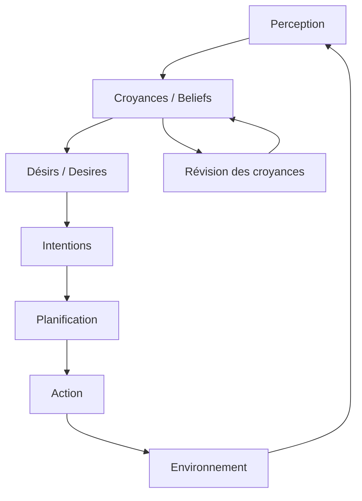

## Introduction

Au cours d'un entretien technique, l'examinateur m'a posé cette question : *"C'est quoi un agent ?"*

Si la question vous paraît simple, la réponse ne l'est pas forcément. Vous pouvez répondre *"Ce sont des scripts qui permettent à un LLM d'interagir avec du contenu, des logiciels, des outils informatiques et même le monde réel"*. Vous n'avez pas tord, mais c'est comme si je vous demandais : *"C'est quoi l'intelligence artificielle ?"* et que vous me répondiez "ChatGPT"...

Le problème est le glissement sémantique et la dérive considérable qu'à pris le mot **"agent"** en trente ans, particulièrement ces derniers mois avec l'apparition des "IA Agentique". 
Ce que l'industrie appelle "agent" en 2026 n'a presque plus rien à voir avec ce que la communauté scientifique des Systèmes Multi-Agents (MAS) a défini lors de sa création dans les années 1990.

Ayant moi-même un doctorat en intelligence artificielle, spécialisé dans le domaine scientifique des Systèmes Multi-Agents, je suis toujours embêté de répondre à cette question, car je sais que l'examinateur attend une définition simple, d'un outil permettant d'augmenter les capacités de son LLM. Mais quel affront à la communauté scientifique et aux pionniers du domaine de s'arrêter là...

Cet article retrace l'histoire du concept, de sa formalisation académique à sa réappropriation par l'écosystème LLM.

---

## Les fondations : années 1990

*Je sais que le domaine existait déjà avant les années 90, mais la formalisation la plus complète et la plus reconnue est ici, alors débutons déjà avec celle-ci.*

### Russell & Norvig : l'agent comme abstraction universelle

En 1995, Stuart Russell et Peter Norvig publient *Artificial Intelligence: A Modern Approach*, qui deviendra le manuel de référence en IA. Ils y proposent une définition volontairement large :

> *"An agent is anything that can be viewed as perceiving its environment through sensors and acting upon that environment through actuators."*
>
> — Russell & Norvig, 1995 [1]

Cette définition est englobante par conception. Un thermostat est un agent. Un robot est un agent. Un programme qui joue aux échecs est un agent. C'est un cadre conceptuel, pas une spécification technique.

```mermaid {title="Fig. 1 — Boucle perception-action (Russell & Norvig, 1995)"}
graph LR
    E[Environnement] -->|percepts| A[Agent]
    A -->|actions| E
```

Le modèle est simple : **perception → décision → action**, et on boucle. Russell et Norvig classifient ensuite les agents selon leur sophistication : agents réflexes simples, agents basés sur des modèles, agents basés sur des buts, agents basés sur l'utilité.

### Wooldridge & Jennings : la définition qui fait référence

La même année, Michael Wooldridge et Nicholas Jennings publient *"Intelligent Agents: Theory and Practice"* dans The Knowledge Engineering Review [2]. C'est **le** papier fondateur du domaine des systèmes multi-agents.

Ils introduisent deux niveaux de définition.

#### La notion faible de l'agent (*weak notion*)

Un agent est un système informatique qui possède les propriétés suivantes :

- **Autonomie** (*autonomy*) : l'agent opère sans intervention directe d'un humain ou d'un autre agent, et contrôle ses propres actions et son état interne
- **Capacité sociale** (*social ability*) : l'agent interagit avec d'autres agents (et éventuellement des humains) via un langage de communication
- **Réactivité** (*reactivity*) : l'agent perçoit son environnement et répond en temps utile aux changements qui s'y produisent
- **Pro-activité** (*pro-activeness*) : l'agent ne se contente pas de réagir — il prend des initiatives en fonction de ses buts

Ces quatre propriétés sont **conjonctives** : un système qui n'en possède qu'une partie n'est pas un agent au sens de Wooldridge & Jennings.

#### La notion forte de l'agent (*strong notion*)

Au-delà des propriétés comportementales, certains chercheurs attribuent aux agents des **états mentaux** :

- **Croyances** (*beliefs*) : ce que l'agent tient pour vrai sur le monde
- **Désirs** (*desires*) : les états du monde que l'agent souhaite atteindre
- **Intentions** (*intentions*) : les désirs que l'agent s'est engagé à poursuivre

C'est le modèle **BDI** (Belief-Desire-Intention), formalisé par Rao et Georgeff [3], qui deviendra l'architecture de référence pour les agents rationnels.

### Jacques Ferber : la perspective multi-agents

En 1995 également, Jacques Ferber publie *Les Systèmes Multi-Agents : vers une intelligence collective* [4]. Sa définition insiste sur l'**environnement** et les **interactions** :

> Un agent est une entité physique ou virtuelle :
> - qui est capable d'agir dans un environnement,
> - qui peut communiquer avec d'autres agents,
> - qui est mue par un ensemble de tendances (objectifs, fonctions de satisfaction),
> - qui possède des ressources propres,
> - qui est capable de percevoir (de manière limitée) son environnement,
> - qui ne dispose que d'une représentation partielle de cet environnement,
> - qui possède des compétences et offre des services,
> - qui peut éventuellement se reproduire,
> - dont le comportement tend à satisfaire ses objectifs en tenant compte des ressources et compétences dont elle dispose, et en fonction de sa perception, de ses représentations et des communications qu'elle reçoit.

Ferber apporte une nuance essentielle : la **représentation partielle**. Un agent n'est pas omniscient, il ne voit pas tout. Il raisonne avec une information incomplète, dans un environnement qu'il ne contrôle pas entièrement. C'est ce qui distingue un agent d'un programme classique qui a accès à l'intégralité de l'état du système et à l'intégralité des données.

### Yoav Shoham : la programmation orientée agent

Dès 1993, Yoav Shoham propose le paradigme de **programmation orientée agent** (AOP) [5], par analogie avec la programmation orientée objet (OOP) :

| | OOP | AOP |
|---|---|---|
| **Unité de base** | objet | agent |
| **État** | attributs | croyances, engagements |
| **Interaction** | appel de méthode | envoi de message (actes de langage) |
| **Comportement** | méthodes | gestion d'obligations et de capacités |

L'idée est puissante : là où un objet encapsule des données et des méthodes, un agent encapsule des **croyances** et des **capacités de décision**.

---

## La maturation : années 2000

### FIPA et la standardisation

La **Foundation for Intelligent Physical Agents** (FIPA) publie une série de standards pour l'interopérabilité des systèmes multi-agents [6]. Les spécifications couvrent :

- **ACL** (Agent Communication Language) : un langage de communication formalisé entre agents, basé sur la théorie des actes de langage (performatifs : *inform*, *request*, *propose*, *refuse*...)
- **Agent Management** : cycle de vie des agents (création, suspension, migration, destruction)
- **Interaction Protocols** : protocoles standardisés (Contract Net, enchères, négociation)

La plateforme **JADE** (Java Agent DEvelopment Framework) implémente ces standards et devient **le** framework de référence dans la recherche MAS.

### Le modèle BDI en pratique

Le modèle BDI trouve des implémentations concrètes avec des plateformes comme **Jason** (basé sur AgentSpeak) et **JACK**. L'architecture type :



L'agent perçoit, met à jour ses croyances, reconsidère ses désirs, s'engage sur des intentions, planifie et agit. Le cycle est continu, et à chaque étape l'agent peut **reconsidérer** ses engagements si l'environnement a changé.

### Ce qui définit un "vrai" agent à cette époque

À la fin des années 2000, un consensus se dégage dans la communauté. Un agent, c'est :

1. **Situé** dans un environnement qu'il perçoit partiellement
2. **Autonome** dans ses décisions (pas de contrôle externe direct)
3. **Social** — il communique via des protocoles définis
4. **Proactif** — il poursuit des buts, pas seulement des instructions
5. **Persistant** — il a un cycle de vie continu, pas un appel de fonction ponctuel

---

## L'intermède : années 2010

### L'agent en apprentissage par renforcement

Le terme "agent" revient en force avec le **Reinforcement Learning** (RL). Dans ce contexte, un agent est une entité qui apprend une politique optimale par interaction avec un environnement :

- **État** → observation de l'environnement
- **Action** → choix parmi les actions disponibles
- **Récompense** → signal de feedback

Les succès de DeepMind (AlphaGo, 2016) popularisent cette acception. L'agent RL est fidèle au schéma perception-action de Russell & Norvig, mais il n'a pas de croyances explicites, pas de communication avec d'autres agents, pas d'intentions au sens BDI.

C'est le **premier glissement** : l'agent perd sa dimension sociale et intentionnelle.

---

## La rupture : 2023 — aujourd'hui

### L'explosion des "LLM agents"

En 2023, tout change. L'arrivée de GPT-4 et de modèles de langage capables de raisonner, de planifier et d'utiliser des outils provoque une réappropriation massive du terme "agent".

Quelques repères :
- **Auto-GPT** (mars 2023) : un LLM qui se donne des sous-tâches et les exécute en boucle
- **BabyAGI** (avril 2023) : gestion de liste de tâches par un LLM
- **LangChain Agents** : un LLM qui choisit quel outil appeler en fonction d'une requête
- **CrewAI, AutoGen, LangGraph** : frameworks multi-agents basés sur des LLM

### Ce que l'industrie appelle "agent" aujourd'hui

La définition dominante en 2025-2026 :

> Un agent est un LLM augmenté de la capacité à utiliser des outils, à planifier des étapes, et à s'exécuter en boucle jusqu'à compléter une tâche.

Concrètement, le pattern est :

```mermaid {title="Fig. 3 — Boucle ReAct : le pattern \"agent\" LLM (2023)"}
graph LR
    U[Utilisateur] -->|prompt| L[LLM]
    L -->|raisonnement| L
    L -->|appel| T[Outils / APIs]
    T -->|résultat| L
    L -->|réponse| U
```

C'est la boucle **ReAct** (Reasoning + Acting) [7] : le LLM raisonne, choisit une action, observe le résultat, et recommence.

### Ce qui a été perdu en route

Comparons avec les critères de Wooldridge & Jennings :

| Propriété | Agent MAS (1995) | "Agent" LLM (2025) |
|---|---|---|
| **Autonomie** | Contrôle total de son état interne et de ses décisions | Partiellement — le LLM décide des actions, mais il est contrôlé par le prompt et l'orchestrateur |
| **Réactivité** | Perçoit un environnement en continu | Réagit à un input ponctuel, pas de perception continue |
| **Pro-activité** | Poursuit des buts propres, prend des initiatives | Exécute une tâche donnée par l'utilisateur, pas de buts intrinsèques |
| **Capacité sociale** | Protocoles de communication formalisés (ACL, FIPA) | Pas de communication inter-agents standardisée (chaque framework invente la sienne) |
| **Persistance** | Cycle de vie continu | Souvent éphémère — un appel API, puis destruction |
| **Représentation partielle** | L'agent sait qu'il ne sait pas tout | Le LLM a tendance à halluciner plutôt qu'à reconnaître son ignorance |
| **Croyances / BDI** | Explicites, formalisées | Aucune — le "raisonnement" est une génération de texte |

Le constat est net : ce que l'industrie appelle "agent" en 2025 est, au regard de la définition académique, **un programme qui appelle un LLM en boucle avec des outils**. C'est utile, c'est puissant, mais ce n'est pas un agent au sens où Wooldridge, Jennings ou Ferber l'entendaient.

### Pourquoi ce glissement ?

Plusieurs facteurs :

1. **Le marketing** : "agent" est plus vendeur que "LLM avec boucle d'outils"
2. **L'analogie superficielle** : un LLM qui "décide" quelle fonction appeler *ressemble* à un agent qui choisit une action
3. **L'oubli historique** : la communauté LLM redécouvre des concepts (planification, mémoire, coopération) sans toujours prendre en compte les décennies de recherche qui les ont formalisés
4. **La simplification** : les propriétés de Wooldridge & Jennings sont exigeantes. Il est plus facile de les ignorer que de les implémenter

---

## Vers une réconciliation ?

Le rapprochement est en cours. Les frameworks récents commencent à réintégrer des concepts issus de la recherche MAS :

- **Mémoire persistante** : les agents LLM acquièrent une mémoire à long terme (RAG, vector stores), se rapprochant de la notion de croyances
- **Communication structurée** : des frameworks comme AutoGen introduisent des protocoles d'échange entre agents
- **Rôles et spécialisation** : CrewAI assigne des rôles formels aux agents (analyste, rédacteur, validateur), rappelant les organisations multi-agents de Ferber
- **Planification** : LangGraph modélise les agents comme des graphes d'états, proches des machines à états BDI

Mais il manque encore des éléments fondamentaux : l'**autonomie réelle** (un agent qui ne soit pas esclave de son prompt), la **représentation partielle explicite** (savoir ce qu'on ne sait pas), et des **protocoles de communication standardisés** (l'équivalent de FIPA pour les LLM agents n'existe pas).

---

## Pour résumer

Si on vous demande *"C'est quoi un agent ?"*, la réponse honnête, d'un chercheur expérimenté et soucieux de la communauté sera probablement :

**Au sens académique (Wooldridge & Jennings, 1995)** : un système autonome, situé dans un environnement, capable de percevoir, d'agir, de communiquer et de poursuivre des buts de manière proactive.

Mais si vous voulez travailler dans une entreprise moins soucieuse de la recherche que du marketing, alors on attendra sans doute de vous que vous répondiez :

**Au sens industriel actuel** : un LLM augmenté d'outils et d'une boucle d'exécution, capable de décomposer une tâche en étapes et de les exécuter.

Les deux définitions ne sont pas incompatibles, mais la seconde est un **sous-ensemble appauvri** de la première. Le défi des prochaines années sera de combler cet écart — et les décennies de recherche en systèmes multi-agents sont une mine d'or largement sous-exploitée pour y parvenir.

---

## Sources

1. Russell, S., & Norvig, P. (1995). *Artificial Intelligence: A Modern Approach*. Prentice Hall.
2. Wooldridge, M., & Jennings, N. R. (1995). *Intelligent Agents: Theory and Practice*. The Knowledge Engineering Review, 10(2), 115-152.
3. Rao, A. S., & Georgeff, M. P. (1995). *BDI Agents: From Theory to Practice*. Proceedings of the First International Conference on Multi-Agent Systems (ICMAS-95).
4. Ferber, J. (1995). *Les Systèmes Multi-Agents : Vers une intelligence collective*. InterEditions.
5. Shoham, Y. (1993). *Agent-Oriented Programming*. Artificial Intelligence, 60(1), 51-92.
6. FIPA — Foundation for Intelligent Physical Agents. *FIPA Agent Communication Language Specifications* (2002). http://www.fipa.org/specs/
7. Yao, S., et al. (2023). *ReAct: Synergizing Reasoning and Acting in Language Models*. ICLR 2023.
