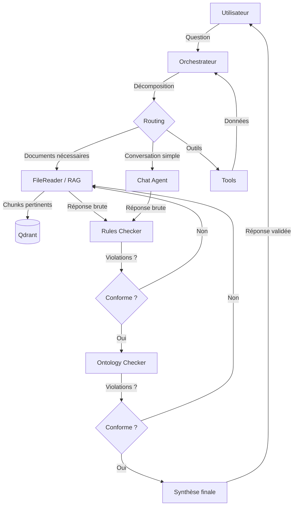

## Le problème : personne ne fait confiance à un LLM en production

Demandez à un LLM la posologie d'un médicament, la procédure de maintenance d'une turbine ou les contraintes réglementaires d'un contrat.
Il vous répondra avec assurance... mais il se trompera parfois.

Les solutions développées récemment atténuent le problème, sans pour autant le résoudre totalement :

- **LLM seul** : aucune source, aucune garantie, hallucinations fréquentes
- **RAG classique** : le modèle s'appuie sur des documents réels, mais rien ne l'empêche d'interpréter librement le contenu récupéré
- **RAG agentique** : un orchestrateur décompose la requête et mobilise des outils spécialisés, mais sans les outils adéquats, la réponse finale reste une génération non vérifiée

Le vrai besoin en contexte critique, c'est une **garantie de conformité** : la réponse respecte elle les règles métier ? Est-elle cohérente avec le modèle de connaissances du domaine ?

C'est le problème que je résous ici, avec le projet : [onto-ragllm](https://github.com/Simon-Stephan/onto-ragllm).

## L'idée : générer, puis vérifier, puis corriger

Onto-RagLLM est un système hybride qui combine un pipeline RAG agentique avec une **double couche de validation** : par règles métier (vérification sémantique via LLM) et par ontologie (vérification formelle via raisonnement OWL).

Le principe est simple : on ne fait jamais confiance à la sortie d'un LLM sans l'avoir passée au crible.
Si elle ne passe pas ? On la renvoie à l'agent concerné avec les violations constatées pour qu'il corrige.
Et l'opération peut se répéter jusqu'à ce que la génération réponde aux exigence du métier.

## Architecture

Cinq composants clés :

1. **Orchestrateur** — Analyse la requête, décide quels agents et outils mobiliser, agrège les résultats
2. **FileReader (RAG)** — Recherche vectorielle dans Qdrant, expansion contextuelle par chunks adjacents, génération augmentée par les documents
3. **Rules Checker** — Validation sémantique par LLM : chaque règle métier est testée contre la réponse
4. **Ontology Checker** — Validation formelle par raisonneur OWL (HermiT) : contraintes de types, de plages numériques, d'unités, de patterns
5. **Synthétiseur** — Génère la réponse finale à partir des données validées

## Pourquoi c'est mieux qu'un RAG classique

### Le RAG classique : retrouver, pas vérifier

Un RAG récupère des chunks pertinents et les injecte dans le prompt.
Le LLM génère une réponse *à partir* de ces sources.
Mais rien ne garantit qu'il n'extrapole pas, qu'il ne mélange pas deux informations incompatibles, ou qu'il ne viole pas une contrainte métier absente du corpus.

**Exemple** : une documentation technique indique qu'une maintenance de niveau 3 nécessite une habilitation électrique.
Le RAG retrouve le bon passage.
Le LLM génère une procédure de maintenance.
Mais il omet l'habilitation, parce qu'elle n'apparaissait pas dans le chunk le plus pertinent.

### Le RAG agentique : orchestrer, pas contrôler

Un RAG agentique améliore la situation en décomposant la requête et en mobilisant plusieurs agents spécialisés.
L'orchestrateur peut décider de chercher dans les documents *et* d'appeler un outil externe.
La qualité de décomposition s'améliore.
Mais la réponse finale reste le produit d'un LLM, sans vérification formelle.

### Onto-RagLLM : générer, vérifier, corriger

Onto-RagLLM ajoute deux couches qui changent fondamentalement la donne :

**Le Rules Checker** opère une vérification sémantique.
Chaque règle métier définie par l'utilisateur est évaluée par un LLM dédié qui juge si la réponse la respecte.
Ce n'est pas une simple recherche de mots-clés — c'est une analyse contextuelle de conformité, avec trois niveaux de sévérité (`error`, `warning`, `info`).

**L'Ontology Checker** va plus loin : il construit dynamiquement une ontologie OWL à partir des règles formelles, ou utilise l'ontologie chargée par l'utilisateur, instancie la réponse comme un individu de cette ontologie, puis lance le raisonneur **HermiT** pour détecter les incohérences.
Les contraintes numériques (plages de valeurs), les unités obligatoires, les patterns regex ou encore les termes interdits sont vérifiés de manière **déterministe** — pas par un LLM, mais par un moteur de raisonnement formel.

Si une violation est détectée, la réponse est renvoyée à l'agent d'origine avec la liste des violations.
L'agent régénère sa réponse en tenant compte des contraintes, et le cycle de validation recommence.
C'est une **boucle de correction convergente** : à chaque itération, l'agent dispose de plus d'information sur ce qu'il doit respecter.

## L'ontologie comme filet de sécurité

Ce qui rend l'approche intéressante, c'est que la validation ontologique est **déterministe**.
Un raisonneur OWL ne "pense pas que" la réponse est conforme — il le prouve ou le réfute formellement.

Concrètement, l'Ontology Checker :

1. Crée un `World` isolé (Owlready2) pour chaque vérification
2. Charge les fichiers OWL/RDF fournis par l'utilisateur
3. Traduit les règles en propriétés OWL avec contraintes de type
4. Instancie la réponse comme un individu et peuple ses propriétés
5. Applique l'hypothèse du monde fermé (CWA)
6. Lance HermiT — toute incohérence est une violation

Et si le raisonneur échoue (fichier OWL invalide, timeout), un fallback Python prend le relais avec des vérificateurs procéduraux.
Le système ne s'arrête jamais, il dégrade gracieusement.

## Comparaison directe

| | LLM seul | RAG | RAG agentique | Onto-RagLLM |
|---|---|---|---|---|
| **Source de données** | Poids du modèle | Documents utilisateur | Documents + outils | Documents + outils |
| **Orchestration** | Non | Non | Oui | Oui |
| **Vérification sémantique** | Non | Non | Non | Oui (Rules Checker) |
| **Vérification formelle** | Non | Non | Non | Oui (OWL/HermiT) |
| **Boucle de correction** | Non | Non | Non | Oui |
| **Explicabilité** | Aucune | Citation des sources | Citation des sources | Sources + trace des validations |
| **Garantie métier** | Aucune | Faible | Faible | Forte |

## Ce que l'utilisateur contrôle

L'une des forces du système est que l'utilisateur configure entièrement le cadre de validation :

- **Documents** : il charge ses PDF, Word, Excel — le système les découpe, les vectorise et les rend cherchables
- **Règles métier** : il définit des règles avec un type (`constraint`, `validation`, `inference`), une sévérité et une condition en langage naturel
- **Ontologie** : il charge ses fichiers OWL/RDF qui formalisent le modèle de connaissances du domaine
- **Paramètres de vectorisation** : taille des chunks, overlap, modèle d'embedding — ajustables par thread

Chaque conversation (thread) est un espace isolé avec ses propres documents, règles et ontologie. Un même déploiement peut servir un cas d'usage en maintenance industrielle et un autre en conformité réglementaire.

## Stack technique

| Composant | Choix |
|---|---|
| **Backend** | FastAPI (Python 3.12, async) |
| **Frontend** | Next.js 16 (React 19, TypeScript, Tailwind) |
| **Base de données** | PostgreSQL 15 |
| **Vector Store** | Qdrant |
| **Ontologie** | Owlready2 + HermiT |
| **LLM** | OpenRouter (multi-modèles, fallback automatique) |
| **Embeddings** | Ollama (local) |
| **Déploiement** | Docker Compose |

## Les limites, honnêtement

Le système n'est pas parfait.

La **boucle de correction** est bornée (2 tentatives par défaut).
Si l'agent ne parvient pas à satisfaire les contraintes après ces tentatives, la réponse est retournée avec un avertissement.
Dans la pratique, la plupart des violations sont corrigées dès la première itération — mais ce n'est pas garanti.

Le **Rules Checker** repose sur un LLM pour juger la conformité sémantique.
C'est donc lui-même sujet à erreur.
C'est pour ça qu'il existe *en complément* de l'Ontology Checker (déterministe), pas en remplacement.

La **stratégie fail-open** (en cas d'échec du checker, la réponse est considérée valide) est un choix délibéré de disponibilité.
En contexte critique, on pourrait préférer un fail-close — c'est configurable.

## Conclusion

Onto-RagLLM ne prétend pas rendre un LLM infaillible. Il part du principe que le LLM *va* se tromper, et il met en place les garde-fous nécessaires pour détecter et corriger ces erreurs avant qu'elles n'atteignent l'utilisateur.

L'approche est transposable à n'importe quel domaine où la conformité des réponses est critique : industrie, santé, juridique, finance.
Il suffit de fournir les bons documents, les bonnes règles et la bonne ontologie.

Le code source est disponible et le système se déploie en une commande `docker compose up`.
